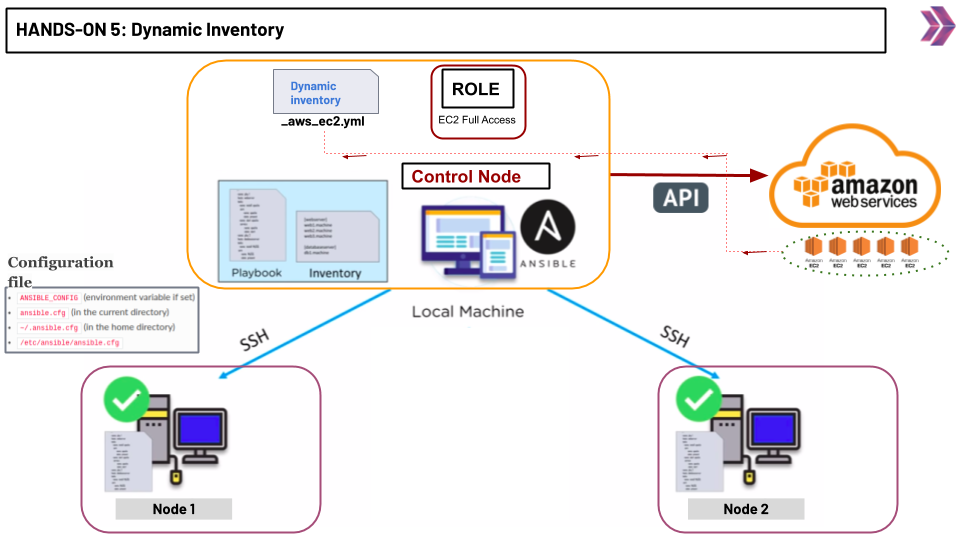

# Hands-on Ansible-05: Working with Dynamic Inventory Using EC2 Plugin

The purpose of this hands-on training is to give students the knowledge of using dynamic inventory.

## Learning Outcomes

At the end of this hands-on training, students will be able to;

- Explain what is dynamic inventory

- Explain how to use dynamic inventory with EC2 plugin.



## Outline

- Part 1 - Build the Infrastructure

- Part 2 - Install Ansible on the Controller Node

- Part 3 - Pinging the Target Nodes with static inventory

- Part 4 - Working with dynamic inventory


## Part 1 - Build the Infrastructure

- Get to the AWS Console and spin-up 3 EC2 Instances with ```Red Hat Enterprise Linux 8``` AMI.

- Configure the security groups as shown below:

    - Controller Node ----> Port 22 SSH

    - Target Node1 -------> Port 22 SSH, Port 80 HTTP

    - Target Node2 -------> Port 22 SSH, Port 80 HTTP

## Part 2 - Install Ansible on the Controller Node

- Connect to your ```Controller Node```.

- Optionally you can connect to your instances using VS Code.

                    -------------------- OPTIONAL BELOW ----------------------

- You can also use connect to the Controller Node via VS Code's ```Remote SSH``` Extension. 

- Open up your VS Code editor. 

- Click on the ```Extensions``` icon. 

- Write down ```Remote - SSH``` on the search bar. 

- Click on the first option on the list.

- Click on the install button.

- When the extension is installed, restart your editor.

- Click on the green button (```Open a Remote Window``` button) at the most bottom left.

- Hit enter. (```Connect Current Window to Host...```)

- Enter a name for your connection on the input field and click on ```Add New SSH Host``` option.

- Enter your ssh connection command (```ssh -i <YOUR-PEM-FILE> ec2-user@<YOUR SERVER IP>```) on the input field and hit enter.

- Hit enter again.

- Click on the ```connect``` button at the bottom right.

- Click on ```continue``` option.

- Click on the ```Open Folder``` button and then click on the ```Ok``` button.

- Lastly, open up a new terminal on the current window.

                    -------------------- OPTIONAL ABOVE ----------------------

- Run the commands below to install Python3 and Ansible. 

```bash
$ sudo yum install -y python3 
```

```bash
$ pip3 install --user ansible
```

- Check Ansible's installation with the command below.

```bash
$ ansible --version
```


- Run the command below to transfer your pem key to your Ansible Controller Node.

```bash
$ scp -i <PATH-TO-PEM-FILE> <PATH-TO-PEM-FILE> ec2-user@<CONTROLLER-NODE-IP>:/home/ec2-user
```


## Part 3 - Pinging the Target Nodes with static inventory


- Make a directory named ```dynamic-inventory``` under the home directory and cd into it.

```bash 
$ mkdir dynamic-inventory
$ cd dynamic-inventory
```

- Create a file named ```inventory.txt``` with the command below.

```bash
$ sudo vi inventory.txt
```

- Paste the content below into the inventory.txt file.

- Along with the hands-on, public or private IPs can be used.

```txt
[servers]
db_server   ansible_host=<YOUR-DB-SERVER-IP>   ansible_user=ec2-user  ansible_ssh_private_key_file=~/<YOUR-PEM-FILE>
web_server  ansible_host=<YOUR-WEB-SERVER-IP>  ansible_user=ec2-user  ansible_ssh_private_key_file=~/<YOUR-PEM-FILE>
test_server  ansible_host=<YOUR-WEB-SERVER-IP>  ansible_user=ec2-user  ansible_ssh_private_key_file=~/<YOUR-PEM-FILE>
```
- Create file named ```ansible.cfg``` under the the ```dynamic-inventory``` directory.

```cfg
[defaults]
host_key_checking = False
inventory=inventory.txt
interpreter_python=auto_silent
```


- Create a file named ```ping-playbook.yml``` and paste the content below.

```bash
$ touch ping-playbook.yml
```

```yml
- name: ping them all
  hosts: all
  tasks:
    - name: pinging
      ping:
```

- Run the command below for pinging the servers.

```bash
$ ansible-playbook ping-playbook.yml
```

- Explain the output of the above command.


## Part4 - Working with dynamic inventory

- go to AWS Management Consol and select the IAM roles:

- click the  "create role" then create a role with "AmazonEC2FullAccess"

- go to EC2 instance Dashboard, and select the control-node instance

- select actions -> security -> modify IAM role

- select the role thay you have jsut created for EC2 full access and save it.

- install "boto3"

```bash
$ sudo pip3 install --user boto3
```

- Create another file named ```inventory_aws_ec2.yml``` in the project directory.

```bash
$ sudo vi inventory_aws_ec2.yml
```

```yml
plugin: aws_ec2
regions:
  - "us-east-1"
keyed_groups:
  - key: tags.Name
compose:
  ansible_host: public_ip_address

```
- see the inventory

```bash
$ ansible-inventory -i inventory_aws_ec2.yml --graph
```

```
@all:
  |--@aws_ec2:
  |  |--ec2-34-201-69-79.compute-1.amazonaws.com
  |  |--ec2-54-234-17-41.compute-1.amazonaws.com
  |--@ungrouped:
```

- To make sure that all our hosts are reachable with dynamic inventory, we will run various ad-hoc commands that use the ping module.

```bash
$ ansible all -m ping --key-file "~/mykey.pem"
```

- create a playbook name "user.yml"

```yml
---
- name: create a user using a variable
  hosts: all
  become: true
  vars:
    user: lisa
    ansible_ssh_private_key_file: "/home/ec2-user/mykey.pem"
  tasks:
    - name: create a user {{ user }}
      user:
        name: "{{ user }}"
```
- run the playbook

```bash
$ ansible-playbook user.yml -i inventory_aws_ec2.yml
```


