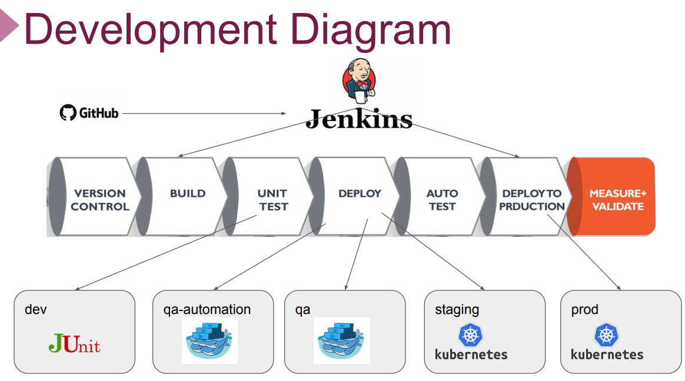
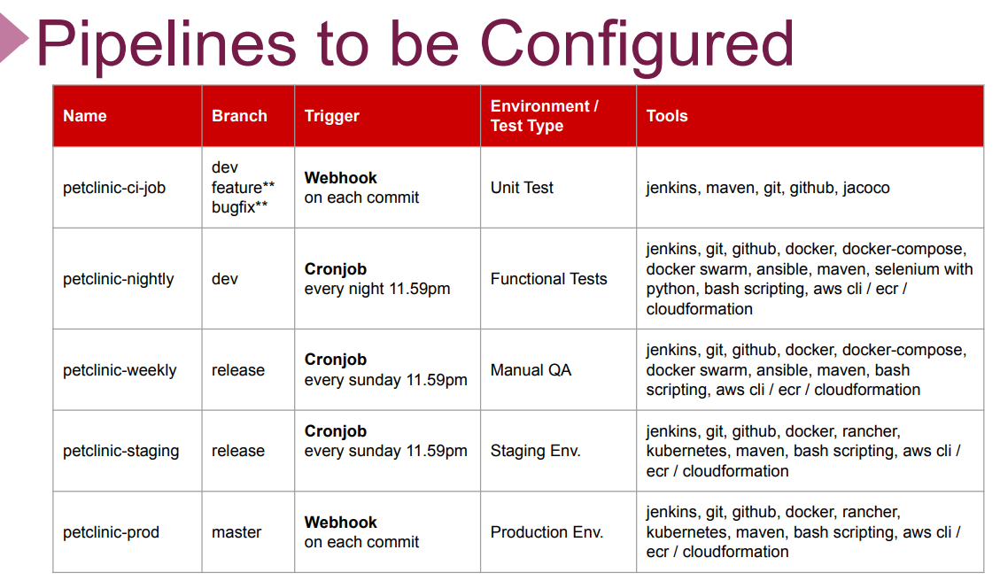

# Project 501: Microservices CI/CD Pipeline

## Description

This project aims to create full CI/CD Pipeline for microservice based applications using [Spring Petclinic Microservices Application](https://github.com/spring-petclinic/spring-petclinic-microservices). Jenkins Server deployed on Elastic Compute Cloud (EC2) Instance is used as CI/CD Server to build pipelines.

## DevOps Pipelines

### Development Diagram



### Pipelines Configurations



## Flow of Tasks for Project Realization

| Epic | Task  | Task #  | Task Definition   | Branch  |
| ---   | :---  | ---                  | :---              | :---    |
| Local Development Environment | Prepare Development Server Manually on EC2 Instance| MSP-1 | Prepare development server manually on Amazon Linux 2 for developers, enabled with `Docker` , `Docker-Compose` , `Java 11` , `Git` .  |
| Local Development Environment | Prepare GitHub Repository for the Project | MSP-2-1 | Clone the Petclinic app from the Clarusway repository [Petclinic Microservices Application](https://github.com/clarusway/petclinic-microservices.git) |
| Local Development Environment | Prepare GitHub Repository for the Project | MSP-2-2 | Prepare base branches namely `master` , `dev` , `release` for DevOps cycle. |
| Local Development Environment | Check the Maven Build Setup on Dev Branch | MSP-3 | Check the Maven builds for `test` , `package` , and `install` phases on `dev` branch |
| Local Development Environment | Prepare a Script for Packaging the Application | MSP-4 |  Prepare a script to package the application with Maven wrapper | feature/msp-4 |
| Local Development Environment | Prepare Development Server Cloudformation Template | MSP-5 |  Prepare development server script with Cloudformation template for developers, enabled with `Docker` , `Docker-Compose` , `Java 11` , `Git` . | feature/msp-5 |
| Local Development Build | Prepare Dockerfiles for Microservices | MSP-6 | | Prepare Dockerfiles for each microservices. | feature/msp-6 |
| Local Development Environment | Prepare Script for Building Docker Images | MSP-7 |  Prepare a script to package and build the docker images for all microservices. | feature/msp-7 |
| Local Development Build | Create Docker Compose File for Local Development | MSP-8-1 |  Prepare docker compose file to deploy the application locally. | feature/msp-8 |
| Local Development Build | Create Docker Compose File for Local Development | MSP-8-2 |  Prepare a script to test the deployment of the app locally. | feature/msp-8 |
| Testing Environment Setup | Implement Unit Tests | MSP-9-1  | Implement 3 Unit Tests locally. | feature/msp-9 |
| Testing Environment Setup | Setup Code Coverage Tool | MSP-9-2  | Update POM file for Code Coverage Report. | feature/msp-9 |
| Testing Environment Setup | Implement Code Coverage | MSP-9-3  | Generate Code Coverage Report manually. | feature/msp-9 |
| Testing Environment Setup | Prepare Selenium Tests | MSP-10-1  | Prepare 3 Selenium Jobs for QA Automation Tests. | feature/msp-10 |
| Testing Environment Setup | Implement Selenium Tests | MSP-10-2  | Run 3 Selenium Tests against local environment. | feature/msp-10 |
| CI Server Setup | Prepare Jenkins Server | MSP-11 | | Prepare Jenkins Server for CI/CD Pipeline. | feature/msp-11 |
| CI Server Setup | Configure Jenkins Server for Project | MSP-12  | Configure Jenkins Server for Project Setup. | |
| CI Server Setup | Prepare CI Pipeline | MSP-13 | | Prepare CI pipeline (UT only) for all `dev` , `feature` and `bugfix` branches. | feature/msp-13 |
| Registry Setup for Development | Create Docker Registry for Dev Manually | MSP-14  | Create Docker Registry on AWS ECR manually using Jenkins job. | |
| Registry Setup for Development | Prepare Script for Docker Registry| MSP-15  | Prepare a script to create Docker Registry on AWS ECR using Jenkins job. | feature/msp-15 |
| QA Automation Setup for Development | Create a QA Automation Environment | MSP-16  | Create a QA Automation Environment with Docker Swarm. | feature/msp-16 |
| QA Automation Setup for Development | Prepare a QA Automation Pipeline | MSP-17  | Prepare a QA Automation Pipeline on `dev` branch for Nightly Builds. | feature/msp-17 |
| QA Setup for Release | Create a Key Pair for QA Environment | MSP-18-1  | Create a permanent Key Pair for Ansible to be used in QA Environment on Release. | feature/msp-18 |
| QA Setup for Release | Create a QA Infrastructure with AWS Cloudformation | MSP-18-2  | Create a Permanent QA Infrastructure for Docker Swarm with AWS Cloudformation. | feature/msp-18 |
| QA Setup for Release | Create a QA Environment with Docker Swarm | MSP-18-3  | Create a QA Environment for Release with Docker Swarm. | feature/msp-18 |
| QA Setup for Release | Prepare Build Scripts for QA Environment | MSP-19  | Prepare Build Scripts for creating ECR Repo for QA, building QA Docker images, deploying app with Docker Compose. | feature/msp-19 |
| QA Setup for Release | Build and Deploy App on QA Environment Manually | MSP-20  | Build and Deploy App for QA Environment Manually using Jenkins Jobs. | feature/msp-20 | 
| QA Setup for Release | Prepare a QA Pipeline | MSP-21  | Prepare a QA Pipeline using Jenkins on `release` branch for Weekly Builds. | feature/msp-21 |
| Staging and Production Setup | Prepare Petlinic Kubernetes YAML Files | MSP-22  | Prepare Petlinic Kubernetes YAML Files for Staging and Production Pipelines. | feature/msp-22 |
| Staging and Production Setup | Prepare HA RKE Kubernetes Cluster | MSP-23  | Prepare High-availability RKE Kubernetes Cluster on AWS EC2 | feature/msp-23 |
| Staging and Production Setup | Install Rancher App on RKE K8s Cluster | MSP-24  | Install Rancher App on RKE Kubernetes Cluster| |
| Staging and Production Setup | Create Staging and Production Environment with Rancher | MSP-25  | Create Staging and Production Environment with Rancher by creating new cluster for Petclinic | |
| Staging Deployment Setup | Prepare a Staging Pipeline | MSP-26  | Prepare a Staging Pipeline on Jenkins Server | feature/msp-26|
| Production Deployment Setup | Prepare a Production Pipeline | MSP-27  | Prepare a Production Pipeline on Jenkins Server | feature/msp-27|
| Production Deployment Setup | Set Domain Name and TLS for Production | MSP-28  | Set Domain Name and TLS for Production Pipeline with Route 53 | feature/msp-28|
| Production Deployment Setup | Set Monitoring Tools | MSP-29  | Set Monitoring tools, Prometheus and Grafana | |

## MSP 1 - Prepare Development Server Manually on EC2 Instance

* Prepare development server manually on Amazon Linux 2 for developers, enabled with `Docker`,  `Docker-Compose`,  `Java 11`,  `Git`.

``` bash
#! /bin/bash
yum update -y
hostnamectl set-hostname petclinic-dev-server
amazon-linux-extras install docker -y
systemctl start docker
systemctl enable docker
usermod -a -G docker ec2-user
curl -L "https://github.com/docker/compose/releases/download/1.26.2/docker-compose-$(uname -s)-$(uname -m)" \
-o /usr/local/bin/docker-compose
chmod +x /usr/local/bin/docker-compose
yum install git -y
yum install java-11-amazon-corretto -y
```

## MSP 2 - Prepare GitHub Repository for the Project

* Clone the petclinic app from the repository [Spring Petclinic Microservices App](https://github.com/clarusway/petclinic-microservices.git) on your local machine

``` bash
git clone https://github.com/clarusway/petclinic-microservices.git
```

* Change your working directory to **petclinic-microservices** and delete the **.git** directory.

```bash
cd petclinic-microservices
rm -rf .git
```

* Create a new repository on your Github with the name **petclinic-microservices**.

*  Initiate the cloned repository on your local machine to make it a git repository and push the local repository to your remote repository.

```bash
git init
git add .
git commit -m "first commit"
git remote add origin https://github.com/[your-git-account]/petclinic-microservices.git
git push origin main
```

* Clone the petclinic-microservices repo from your GitHub repo on development server.

``` bash
git clone https://github.com/clarusway/petclinic-microservices.git
```

* Prepare base branches namely `master`,  `dev`,  `release` for DevOps cycle.

  + Create `dev` base branch.

    ``` bash
    git checkout master
    git branch dev
    git checkout dev
    git push --set-upstream origin dev
    ```

  + Create `release` base branch.

    ```bash
    git checkout master
    git branch release
    git checkout release
    git push --set-upstream origin release
    ```

## MSP 3 - Check the Maven Build Setup on Dev Branch

* Switch to `dev` branch.

``` bash
git checkout dev
```

* Test the compiled source code.

``` bash
./mvnw clean test
```
> Note: If you get `permission denied` error, try to give execution permission to **mvnw**.  

    chmod +x mvnw
  

* Take the compiled code and package it in its distributable `JAR` format.

``` bash
./mvnw clean package
```

* Install distributable `JAR`s into local repository.

``` bash
./mvnw clean install
```

## MSP 4 - Prepare a Script for Packaging the Application

* Create `feature/msp-4` branch from `dev`.

``` bash
git checkout dev
git branch feature/msp-4
git checkout feature/msp-4
```

* Prepare a script to package the application with maven wrapper and save it as `package-with-mvn-wrapper.sh`.

``` bash
./mvnw clean package
```

* Commit and push the new script to remote repo.

``` bash
git add .
git commit -m 'added packaging script'
git push --set-upstream origin feature/msp-4
git checkout dev
git merge feature/msp-4
git push origin dev
```

## MSP 5 - Prepare Development Server Cloudformation Template

* Create `feature/msp-5` branch from `dev`.

``` bash
git checkout dev
git branch feature/msp-5
git checkout feature/msp-5
```

* Create a folder for infrastructure setup with the name of `infrastructure`.

``` bash
mkdir infrastructure
```

* Prepare development server script with [Cloudformation template](./msp-5-dev-server-for-petclinic-app-cfn-template.yml) for developers, enabled with `Docker`,  `Docker-Compose`,  `Java 11`,  `Git` and save it as `dev-server-for-petclinic-app-cfn-template.yml` under `infrastructure` folder.

``` bash
#! /bin/bash
yum update -y
hostnamectl set-hostname petclinic-dev-server
amazon-linux-extras install docker -y
systemctl start docker
systemctl enable docker
usermod -a -G docker ec2-user
curl -L "https://github.com/docker/compose/releases/download/1.26.2/docker-compose-$(uname -s)-$(uname -m)" \
-o /usr/local/bin/docker-compose
chmod +x /usr/local/bin/docker-compose
yum install git -y
yum install java-11-amazon-corretto -y
git clone https://github.com/clarusway/petclinic-microservices.git
git fetch
git checkout dev
```

* Commit and push the new script to remote repo.

``` bash
git add .
git commit -m 'added cloudformation template for dev server'
git push --set-upstream origin feature/msp-5
git checkout dev
git merge feature/msp-5
git push origin dev
```

## MSP 6 - Prepare Dockerfiles for Microservices

* Create `feature/msp-6` branch from `dev`.

``` bash
git checkout dev
git branch feature/msp-6
git checkout feature/msp-6
```

* Prepare a Dockerfile for the `admin-server` microservice with following content and save it under `spring-petclinic-admin-server`.

``` Dockerfile
FROM openjdk:11-jre
ARG DOCKERIZE_VERSION=v0.6.1
ARG EXPOSED_PORT=9090
ENV SPRING_PROFILES_ACTIVE docker
ADD https://github.com/jwilder/dockerize/releases/download/${DOCKERIZE_VERSION}/dockerize-alpine-linux-amd64-${DOCKERIZE_VERSION}.tar.gz dockerize.tar.gz
RUN tar -xzf dockerize.tar.gz
RUN chmod +x dockerize
ADD ./target/*.jar /app.jar
EXPOSE ${EXPOSED_PORT}
ENTRYPOINT ["java", "-Djava.security.egd=file:/dev/./urandom","-jar","/app.jar"]
```

* Prepare a Dockerfile for the `api-gateway` microservice with the following content and save it under `spring-petclinic-api-gateway`.

``` Dockerfile
FROM openjdk:11-jre
ARG DOCKERIZE_VERSION=v0.6.1
ARG EXPOSED_PORT=8080
ENV SPRING_PROFILES_ACTIVE docker
ADD https://github.com/jwilder/dockerize/releases/download/${DOCKERIZE_VERSION}/dockerize-alpine-linux-amd64-${DOCKERIZE_VERSION}.tar.gz dockerize.tar.gz
RUN tar -xzf dockerize.tar.gz
RUN chmod +x dockerize
ADD ./target/*.jar /app.jar
EXPOSE ${EXPOSED_PORT}
ENTRYPOINT ["java", "-Djava.security.egd=file:/dev/./urandom","-jar","/app.jar"]
```

* Prepare a Dockerfile for the `config-server` microservice with the following content and save it under `spring-petclinic-config-server`.

``` Dockerfile
FROM openjdk:11-jre
ARG DOCKERIZE_VERSION=v0.6.1
ARG EXPOSED_PORT=8888
ENV SPRING_PROFILES_ACTIVE docker
ADD https://github.com/jwilder/dockerize/releases/download/${DOCKERIZE_VERSION}/dockerize-alpine-linux-amd64-${DOCKERIZE_VERSION}.tar.gz dockerize.tar.gz
RUN tar -xzf dockerize.tar.gz
RUN chmod +x dockerize
ADD ./target/*.jar /app.jar
EXPOSE ${EXPOSED_PORT}
ENTRYPOINT ["java", "-Djava.security.egd=file:/dev/./urandom","-jar","/app.jar"]
```

* Prepare a Dockerfile for the `customer-service` microservice with the following content and save it under `spring-petclinic-customer-service`.

``` Dockerfile
FROM openjdk:11-jre
ARG DOCKERIZE_VERSION=v0.6.1
ARG EXPOSED_PORT=8081
ENV SPRING_PROFILES_ACTIVE docker
ADD https://github.com/jwilder/dockerize/releases/download/${DOCKERIZE_VERSION}/dockerize-alpine-linux-amd64-${DOCKERIZE_VERSION}.tar.gz dockerize.tar.gz
RUN tar -xzf dockerize.tar.gz
RUN chmod +x dockerize
ADD ./target/*.jar /app.jar
EXPOSE ${EXPOSED_PORT}
ENTRYPOINT ["java", "-Djava.security.egd=file:/dev/./urandom","-jar","/app.jar"]
```

* Prepare a Dockerfile for the `discovery-server` microservice with the following content and save it under `spring-petclinic-discovery-server`.

``` Dockerfile
FROM openjdk:11-jre
ARG DOCKERIZE_VERSION=v0.6.1
ARG EXPOSED_PORT=8761
ENV SPRING_PROFILES_ACTIVE docker
ADD https://github.com/jwilder/dockerize/releases/download/${DOCKERIZE_VERSION}/dockerize-alpine-linux-amd64-${DOCKERIZE_VERSION}.tar.gz dockerize.tar.gz
RUN tar -xzf dockerize.tar.gz
RUN chmod +x dockerize
ADD ./target/*.jar /app.jar
EXPOSE ${EXPOSED_PORT}
ENTRYPOINT ["java", "-Djava.security.egd=file:/dev/./urandom","-jar","/app.jar"]
```

* Prepare a Dockerfile for the `hystrix-dashboard` microservice with the following content and save it under `spring-petclinic-hystrix-dashboard`.

``` Dockerfile
FROM openjdk:11-jre
ARG DOCKERIZE_VERSION=v0.6.1
ARG EXPOSED_PORT=7979
ENV SPRING_PROFILES_ACTIVE docker
ADD https://github.com/jwilder/dockerize/releases/download/${DOCKERIZE_VERSION}/dockerize-alpine-linux-amd64-${DOCKERIZE_VERSION}.tar.gz dockerize.tar.gz
RUN tar -xzf dockerize.tar.gz
RUN chmod +x dockerize
ADD ./target/*.jar /app.jar
EXPOSE ${EXPOSED_PORT}
ENTRYPOINT ["java", "-Djava.security.egd=file:/dev/./urandom","-jar","/app.jar"]
```

* Prepare a Dockerfile for the `vets-service` microservice with the following content and save it under `spring-petclinic-vets-service`.

``` Dockerfile
FROM openjdk:11-jre
ARG DOCKERIZE_VERSION=v0.6.1
ARG EXPOSED_PORT=8083
ENV SPRING_PROFILES_ACTIVE docker
ADD https://github.com/jwilder/dockerize/releases/download/${DOCKERIZE_VERSION}/dockerize-alpine-linux-amd64-${DOCKERIZE_VERSION}.tar.gz dockerize.tar.gz
RUN tar -xzf dockerize.tar.gz
RUN chmod +x dockerize
ADD ./target/*.jar /app.jar
EXPOSE ${EXPOSED_PORT}
ENTRYPOINT ["java", "-Djava.security.egd=file:/dev/./urandom","-jar","/app.jar"]
```

* Prepare a Dockerfile for the `visits-service` microservice with the following content and save it under `spring-petclinic-visits-service`.

``` Dockerfile
FROM openjdk:11-jre
ARG DOCKERIZE_VERSION=v0.6.1
ARG EXPOSED_PORT=8082
ENV SPRING_PROFILES_ACTIVE docker
ADD https://github.com/jwilder/dockerize/releases/download/${DOCKERIZE_VERSION}/dockerize-alpine-linux-amd64-${DOCKERIZE_VERSION}.tar.gz dockerize.tar.gz
RUN tar -xzf dockerize.tar.gz
RUN chmod +x dockerize
ADD ./target/*.jar /app.jar
EXPOSE ${EXPOSED_PORT}
ENTRYPOINT ["java", "-Djava.security.egd=file:/dev/./urandom","-jar","/app.jar"]
```

* Commit the changes, then push the Dockerfiles to the remote repo.

``` bash
git add .
git commit -m 'added Dockerfiles for microservices'
git push --set-upstream origin feature/msp-6
git checkout dev
git merge feature/msp-6
git push origin dev
```

## MSP 7 - Prepare Script for Building Docker Images

* Create `feature/msp-7` branch from `dev`.

``` bash
git checkout dev
git branch feature/msp-7
git checkout feature/msp-7
```

* Prepare a script to build the docker images and save it as `build-dev-docker-images.sh`.

``` bash
./mvnw clean package
docker build --force-rm -t "petclinic-admin-server:dev" ./spring-petclinic-admin-server
docker build --force-rm -t "petclinic-api-gateway:dev" ./spring-petclinic-api-gateway
docker build --force-rm -t "petclinic-config-server:dev" ./spring-petclinic-config-server
docker build --force-rm -t "petclinic-customers-service:dev" ./spring-petclinic-customers-service
docker build --force-rm -t "petclinic-discovery-server:dev" ./spring-petclinic-discovery-server
docker build --force-rm -t "petclinic-hystrix-dashboard:dev" ./spring-petclinic-hystrix-dashboard
docker build --force-rm -t "petclinic-vets-service:dev" ./spring-petclinic-vets-service
docker build --force-rm -t "petclinic-visits-service:dev" ./spring-petclinic-visits-service
docker build --force-rm -t "petclinic-grafana-server:dev" ./docker/grafana
docker build --force-rm -t "petclinic-prometheus-server:dev" ./docker/prometheus
```

* Give execution permission to build-dev-docker-images.sh. 

```bash
chmod +x build-dev-docker-images.sh
```

* Build the images.

```bash
./build-dev-docker-images.sh
```

* Commit the changes, then push the new script to the remote repo.

``` bash
git add .
git commit -m 'added script for building docker images'
git push --set-upstream origin feature/msp-7
git checkout dev
git merge feature/msp-7
git push origin dev
```

## MSP 8 - Create Docker Compose File for Local Development

* Create `feature/msp-8` branch from `dev`.

``` bash
git checkout dev
git branch feature/msp-8
git checkout feature/msp-8
```

* Prepare docker compose file to deploy the application locally and save it as `docker-compose-local.yml`.

``` yaml
version: '2'

services:
  config-server:
    image: petclinic-config-server:dev
    container_name: config-server
    mem_limit: 512M
    ports:
     - 8888:8888

  discovery-server:
    image: petclinic-discovery-server:dev
    container_name: discovery-server
    mem_limit: 512M
    depends_on:
    - config-server
    entrypoint: ["./dockerize","-wait=tcp://config-server:8888","-timeout=60s","--","java", "-Djava.security.egd=file:/dev/./urandom","-jar","/app.jar"]
    ports:
     - 8761:8761

  customers-service:
    image: petclinic-customers-service:dev
    container_name: customers-service
    mem_limit: 512M
    depends_on:
    - config-server
    - discovery-server
    entrypoint: ["./dockerize","-wait=tcp://discovery-server:8761","-timeout=60s","--","java", "-Djava.security.egd=file:/dev/./urandom","-jar","/app.jar"]
    ports:
    - 8081:8081

  visits-service:
    image: petclinic-visits-service:dev
    container_name: visits-service
    mem_limit: 512M
    depends_on:
     - config-server
     - discovery-server
    entrypoint: ["./dockerize","-wait=tcp://discovery-server:8761","-timeout=60s","--","java", "-Djava.security.egd=file:/dev/./urandom","-jar","/app.jar"]
    ports:
     - 8082:8082

  vets-service:
    image: petclinic-vets-service:dev
    container_name: vets-service
    mem_limit: 512M
    depends_on:
     - config-server
     - discovery-server
    entrypoint: ["./dockerize","-wait=tcp://discovery-server:8761","-timeout=60s","--","java", "-Djava.security.egd=file:/dev/./urandom","-jar","/app.jar"]
    ports:
     - 8083:8083

  api-gateway:
    image: petclinic-api-gateway:dev
    container_name: api-gateway
    mem_limit: 512M
    depends_on:
     - config-server
     - discovery-server
    entrypoint: ["./dockerize","-wait=tcp://discovery-server:8761","-timeout=60s","--","java", "-Djava.security.egd=file:/dev/./urandom","-jar","/app.jar"]
    ports:
     - 8080:8080

  tracing-server:
    image: openzipkin/zipkin
    container_name: tracing-server
    mem_limit: 512M
    environment:
    - JAVA_OPTS=-XX:+UnlockExperimentalVMOptions -Djava.security.egd=file:/dev/./urandom
    ports:
     - 9411:9411

  admin-server:
    image: petclinic-admin-server:dev
    container_name: admin-server
    mem_limit: 512M
    depends_on:
     - config-server
     - discovery-server
    entrypoint: ["./dockerize","-wait=tcp://discovery-server:8761","-timeout=60s","--","java", "-Djava.security.egd=file:/dev/./urandom","-jar","/app.jar"]
    ports:
     - 9090:9090

  hystrix-dashboard:
    image: petclinic-hystrix-dashboard:dev
    container_name: hystrix-dashboard
    mem_limit: 512M
    depends_on:
     - config-server
     - discovery-server
    entrypoint: ["./dockerize","-wait=tcp://discovery-server:8761","-timeout=60s","--","java", "-Djava.security.egd=file:/dev/./urandom","-jar","/app.jar"]
    ports:
     - 7979:7979

  ## Grafana / Prometheus

  grafana-server:
    image: petclinic-grafana-server:dev
    container_name: grafana-server
    mem_limit: 256M
    ports:
    - 3000:3000

  prometheus-server:
    image: petclinic-prometheus-server:dev
    container_name: prometheus-server
    mem_limit: 256M
    ports:
    - 9091:9090
```

* Prepare a script to test the deployment of the app locally with `docker-compose-local.yml` and save it as `test-local-deployment.sh`.

``` bash
docker-compose -f docker-compose-local.yml up
```

* Give execution permission to test-local-deployment.sh.

```bash
chmod +x test-local-deployment.sh
```

* Execute the docker compose.

```bash
./test-local-deployment.sh
```

* Commit the change, then push the docker compose file to the remote repo.

``` bash
git add .
git commit -m 'added docker-compose file and script for local deployment'
git push --set-upstream origin feature/msp-8
git checkout dev
git merge feature/msp-8
git push origin dev
```

## MSP 9 - Setup Unit Tests and Configure Code Coverage Report

* Create `feature/msp-9` branch from `dev`.

``` bash
git checkout dev
git branch feature/msp-9
git checkout feature/msp-9
```

* Create following unit tests for `Pet.java` under `customer-service` microservice using the following `PetTest` class and save it as `PetTest.java` under `./spring-petclinic-customers-service/src/test/java/org/springframework/samples/petclinic/customers/model/` folder.

``` java
package org.springframework.samples.petclinic.customers.model;

import static org.junit.jupiter.api.Assertions.assertEquals;

import java.util.Date;

import org.junit.jupiter.api.Test;
public class PetTest {
    @Test
    public void testGetName(){
        //Arrange
        Pet pet = new Pet();
        //Act
        pet.setName("Fluffy");
        //Assert
        assertEquals("Fluffy", pet.getName());
    }
    @Test
    public void testGetOwner(){
        //Arrange
        Pet pet = new Pet();
        Owner owner = new Owner();
        owner.setFirstName("Call");
        //Act
        pet.setOwner(owner);
        //Assert
        assertEquals("Call", pet.getOwner().getFirstName());
    }
    @Test
    public void testBirthDate(){
        //Arrange
        Pet pet = new Pet();
        Date bd = new Date();
        //Act
        pet.setBirthDate(bd);
        //Assert
        assertEquals(bd,pet.getBirthDate());
    }
}
```

* Commit the change, then push the changes to the remote repo.

``` bash
git add .
git commit -m 'added 3 UTs for customer-service'
git push --set-upstream origin feature/msp-9
```

* Implement unit tests with maven wrapper for only `customer-service` microservice locally on `Dev Server`.

``` bash
. ../mvnw clean test
```

* Update POM file at root folder for Code Coverage Report using `Jacoco` tool plugin.

``` xml
<plugin>
    <groupId>org.jacoco</groupId>
    <artifactId>jacoco-maven-plugin</artifactId>
    <version>0.8.2</version>
    <executions>
        <execution>
            <goals>
                <goal>prepare-agent</goal>
            </goals>
        </execution>
        <!-- attached to Maven test phase -->
        <execution>
            <id>report</id>
            <phase>test</phase>
            <goals>
                <goal>report</goal>
            </goals>
        </execution>
    </executions>
</plugin>
```

* Commit the change, then push the changes to the remote repo.

``` bash
git add .
git commit -m 'updated POM with Jacoco plugin'
git push
git checkout dev
git merge feature/msp-9
git push origin dev
```

* Create code coverage report for only `customer-service` microservice locally on `Dev Server`.

``` bash
. ../mvnw test
```

* Deploy code coverage report (located under relative path `target/site/jacoco` of the microservice) on Simple HTTP Server for only `customer-service` microservice on `Dev Server`.

``` bash
python -m SimpleHTTPServer # for python 2.7
python3 -m http.server # for python 3+
```

## MSP 10 - Prepare and Implement Selenium Tests

* Create `feature/msp-10` branch from `dev`.

``` bash
git checkout dev
git branch feature/msp-10
git checkout feature/msp-10
```

* Create a folder for Selenium jobs with the name of `selenium-jobs`.

``` bash
mkdir selenium-jobs
```

* Create Selenium job (`QA Automation` test) for testing `Owners >> All` page and save it as `test_owners_all_headless.py` under `selenium-jobs` folder.

``` python
from selenium import webdriver
from selenium.webdriver.common.by import By
from selenium.webdriver.support.ui import WebDriverWait
from selenium.webdriver.support import expected_conditions as EC
from time import sleep
import os

# Set chrome options for working with headless mode (no screen)
chrome_options = webdriver.ChromeOptions()
chrome_options.add_argument("headless")
chrome_options.add_argument("no-sandbox")
chrome_options.add_argument("disable-dev-shm-usage")

# Update webdriver instance of chrome-driver with adding chrome options
driver = webdriver.Chrome(options=chrome_options)

# Connect to the application
APP_IP = os.environ['MASTER_PUBLIC_IP']
url = "http://"+APP_IP.strip()+":8080/"
print(url)
driver.get(url)
owners_link = driver.find_element_by_link_text("OWNERS")
owners_link.click()
sleep(2)
all_link = driver.find_element_by_link_text("ALL")
all_link.click()
sleep(2)

# Verify that table loaded
sleep(1)
verify_table = WebDriverWait(driver, 10).until(EC.presence_of_element_located((By.TAG_NAME, "table")))

print("Table loaded")

driver.quit()
```

* Create Selenium job (`QA Automation` test) for testing `Owners >> Register` page and save it as `test_owners_register_headless.py` under `selenium-jobs` folder.

``` python
from selenium import webdriver
from selenium.webdriver.common.keys import Keys
from time import sleep
import random
import os
# Set chrome options for working with headless mode (no screen)
chrome_options = webdriver.ChromeOptions()
chrome_options.add_argument("headless")
chrome_options.add_argument("no-sandbox")
chrome_options.add_argument("disable-dev-shm-usage")

# Update webdriver instance of chrome-driver with adding chrome options
driver = webdriver.Chrome(options=chrome_options)

# Connect to the application
APP_IP = os.environ['MASTER_PUBLIC_IP']
url = "http://"+APP_IP.strip()+":8080/"
print(url)
driver.get(url)
owners_link = driver.find_element_by_link_text("OWNERS")
owners_link.click()
sleep(2)
all_link = driver.find_element_by_link_text("REGISTER")
all_link.click()
sleep(2)
# Register new Owner to Petclinic App
fn_field = driver.find_element_by_name('firstName')
fn = 'Callahan' + str(random.randint(0, 100))
fn_field.send_keys(fn)
sleep(1)
fn_field = driver.find_element_by_name('lastName')
fn_field.send_keys('Clarusway')
sleep(1)
fn_field = driver.find_element_by_name('address')
fn_field.send_keys('Ridge Corp. Street')
sleep(1)
fn_field = driver.find_element_by_name('city')
fn_field.send_keys('McLean')
sleep(1)
fn_field = driver.find_element_by_name('telephone')
fn_field.send_keys('+1230576803')
sleep(1)
fn_field.send_keys(Keys.ENTER)
sleep(1)
# Wait 2 second to get updated Owner List
sleep(2)
# Verify that new user is added to Owner List
if fn in driver.page_source:
    print(fn, 'is added and found in the Owners Table')
    print("Test Passed")
else:
    print(fn, 'is not found in the Owners Table')
    print("Test Failed")
driver.quit()
```

* Create Selenium job (`QA Automation` test) for testing `Veterinarians` page and save it as `test_veterinarians_headless.py` under `selenium-jobs` folder.

``` python
from selenium import webdriver
from selenium.webdriver.common.by import By
from selenium.webdriver.support.ui import WebDriverWait
from selenium.webdriver.support import expected_conditions as EC
from time import sleep
import os

# Set chrome options for working with headless mode (no screen)
chrome_options = webdriver.ChromeOptions()
chrome_options.add_argument("headless")
chrome_options.add_argument("no-sandbox")
chrome_options.add_argument("disable-dev-shm-usage")

# Update webdriver instance of chrome-driver with adding chrome options
driver = webdriver.Chrome(options=chrome_options)

# Connect to the application
APP_IP = os.environ['MASTER_PUBLIC_IP']
url = "http://"+APP_IP.strip()+":8080/"
print(url)
driver.get(url)
vet_link = driver.find_element_by_link_text("VETERINARIANS")
vet_link.click()

# Verify that table loaded
sleep(1)
verify_table = WebDriverWait(driver, 10).until(EC.presence_of_element_located((By.TAG_NAME, "table")))

print("Table loaded")

driver.quit()
```

* Commit the change, then push the selenium jobs to the remote repo.

``` bash
git add .
git commit -m 'added selenium jobs written in python'
git push --set-upstream origin feature/msp-10
git checkout dev
git merge feature/msp-10
git push origin dev
```

## MSP 11 - Prepare Jenkins Server for CI/CD Pipeline

* Create `feature/msp-11` branch from `dev`.

``` bash
git checkout dev
git branch feature/msp-11
git checkout feature/msp-11
```

* Set up a Jenkins Server and enable it with `Git`,  `Docker`,  `Docker Compose`,  `AWS CLI v2`, `Python`,  `Ansible` and `Boto3`.  To do so, prepare a [Cloudformation template for Jenkins Server](./msp-11-jenkins-server-cfn-template.yml) with following script and save it as `jenkins-server-cfn-template.yml` under `infrastructure` folder.

``` bash
#! /bin/bash
# update os
yum update -y
# set server hostname as jenkins-server
hostnamectl set-hostname jenkins-server
# install git
yum install git -y
# install java 11
yum install java-11-amazon-corretto -y
# install jenkins
wget -O /etc/yum.repos.d/jenkins.repo https://pkg.jenkins.io/redhat/jenkins.repo
rpm --import https://pkg.jenkins.io/redhat/jenkins.io.key
yum install jenkins -y
systemctl start jenkins
systemctl enable jenkins
# install docker
amazon-linux-extras install docker -y
systemctl start docker
systemctl enable docker
usermod -a -G docker ec2-user
usermod -a -G docker jenkins
# configure docker as cloud agent for jenkins
cp /lib/systemd/system/docker.service /lib/systemd/system/docker.service.bak
sed -i 's/^ExecStart=.*/ExecStart=\/usr\/bin\/dockerd -H tcp:\/\/127.0.0.1:2375 -H unix:\/\/\/var\/run\/docker.sock/g' /lib/systemd/system/docker.service
systemctl daemon-reload
systemctl restart docker
systemctl restart jenkins
# install docker compose
curl -L "https://github.com/docker/compose/releases/download/1.26.2/docker-compose-$(uname -s)-$(uname -m)" \
-o /usr/local/bin/docker-compose
chmod +x /usr/local/bin/docker-compose
# uninstall aws cli version 1
rm -rf /bin/aws
# install aws cli version 2
curl "https://awscli.amazonaws.com/awscli-exe-linux-x86_64.zip" -o "awscliv2.zip"
unzip awscliv2.zip
./aws/install
# install python 3
yum install python3 -y
# install ansible
pip3 install ansible
# install boto3
pip3 install boto3
```

* Grant permissions to Jenkins Server within Cloudformation template to create Cloudformation Stack and create ECR Registry, push or pull Docker images to ECR Repo.

* Commit the change, then push the cloudformation file to the remote repo.

``` bash
git add .
git commit -m 'added jenkins server cfn template'
git push --set-upstream origin feature/msp-11
git checkout dev
git merge feature/msp-11
git push origin dev
```

## MSP 12 - Configure Jenkins Server for Project

* Get the initial administrative password.

``` bash
sudo cat /var/lib/jenkins/secrets/initialAdminPassword
```

* Enter the temporary password to unlock the Jenkins.

* Install suggested plugins.

* Create first admin user.

* Open your Jenkins dashboard and navigate to `Manage Jenkins` >> `Manage Plugins` >> `Available` tab

* Search and select `GitHub Integration`,  `Docker Plugin`,  `Docker Pipeline`, and `Jacoco` plugins, then click `Install without restart`. Note: No need to install the other `Git plugin` which is already installed can be seen under `Installed` tab.

* Configure Docker as `cloud agent` by navigating to `Manage Jenkins` >> `Manage Nodes and Clouds` >> `Configure Clouds` and using `tcp://localhost:2375` as Docker Host URI.

## MSP 13 - Prepare Continuous Integration (CI) Pipeline

* Create `feature/msp-13` branch from `dev`.

``` bash
git checkout dev
git branch feature/msp-13
git checkout feature/msp-13
```

* Create a folder, named `jenkins`, to keep `Jenkinsfiles` and `Jenkins jobs` of the project.

``` bash
mkdir jenkins
```

* Create a Jenkins job with name of `petclinic-ci-job` with following script to unit tests and configure a webhook to trigger the job. Jenkins `CI Job` should be triggered to run on each commit of `feature**` and `bugfix**` branches and on each `PR` merge to `dev` branch.

* Prepare a script for Jenkins CI job (covering Unit Test only) and save it as `jenkins-petclinic-ci-job.sh` under `jenkins` folder.

``` bash
echo 'Running Unit Tests on Petclinic Application'
docker run --rm -v $HOME/.m2:/root/.m2 -v `pwd`:/app -w /app maven:3.6-openjdk-11 mvn clean test
```

* Add `post-build action` to Jenkins Job to record `Jacoco` Coverage Report.

* Create a webhook for Jenkins CI Job; 

  + Go to the project repository page and click on `Settings`.

  + Click on the `Webhooks` on the left hand menu, and then click on `Add webhook`.

  + Copy the Jenkins URL, paste it into `Payload URL` field, add `/github-webhook/` at the end of URL, and click on `Add webhook`.

  

``` text
  http://[jenkins-server-hostname]:8080/github-webhook/
  ```

* Commit the change, then push the Jenkinsfile to the remote repo.

``` bash
git add .
git commit -m 'added Jenkins Job for CI pipeline'
git push --set-upstream origin feature/msp-13
git checkout dev
git merge feature/msp-13
git push origin dev
```

## MSP 14 - Create Docker Registry for Dev Manually

* Create a Jenkins Job and name it as `create-ecr-docker-registry-for-dev` to create Docker Registry for `dev` on AWS ECR manually.

``` bash
PATH="$PATH:/usr/local/bin"
APP_REPO_NAME="clarusway-repo/petclinic-app-dev"
AWS_REGION="us-east-1"

aws ecr create-repository \
  --repository-name ${APP_REPO_NAME} \
  --image-scanning-configuration scanOnPush=false \
  --image-tag-mutability MUTABLE \
  --region ${AWS_REGION}
```

## MSP 15 - Prepare Script for Development Docker Registry

* Create `feature/msp-15` branch from `dev`.

``` bash
git checkout dev
git branch feature/msp-15
git checkout feature/msp-15
```

* Prepare a script to create Docker Registry for `dev` on AWS ECR and save it as `create-ecr-docker-registry-for-dev.sh` under `infrastructure` folder.

``` bash
PATH="$PATH:/usr/local/bin"
APP_REPO_NAME="clarusway-repo/petclinic-app-dev"
AWS_REGION="us-east-1"

aws ecr create-repository \
  --repository-name ${APP_REPO_NAME} \
  --image-scanning-configuration scanOnPush=false \
  --image-tag-mutability MUTABLE \
  --region ${AWS_REGION}
```

* Commit the change, then push the script to the remote repo.

``` bash
git add .
git commit -m 'added script for creating ECR registry for dev'
git push --set-upstream origin feature/msp-15
git checkout dev
git merge feature/msp-15
git push origin dev
```

## MSP 16 - Create a QA Automation Environment with Docker Swarm

- Create `feature/msp-16` branch from `dev`.

```bash
git checkout dev
git branch feature/msp-16
git checkout feature/msp-16
```

- Prepare a Cloudformation template for Docker Swarm Infrastructure consisting of 3 Managers, 2 Worker Instances and save it as `docker-swarm-infrastructure-cfn-template.yml` under `infrastructure` folder.

- Grant permissions to Docker Machines within Cloudformation template to create ECR Registry, push or pull Docker images to/from ECR Repo.

- Commit the change, then push the cloudformation template to the remote repo.

```bash
git add .
git commit -m 'added cloudformation template for Docker Swarm infrastructure'
git push --set-upstream origin feature/msp-16
```

- Create a Jenkins Job and name it as `test-creating-qa-automation-infrastructure` to test `bash` scripts creating QA Automation Infrastructure for `dev` manually.

- Check the environment tools setup and versions with following script.

```bash
echo $PATH
whoami
PATH="$PATH:/usr/local/bin"
python3 --version
pip3 --version
ansible --version
aws --version
```

- Test creating key pair for `ansible` using AWS CLI with following script.

```bash
PATH="$PATH:/usr/local/bin"
CFN_KEYPAIR="call-ansible-test-dev.key"
AWS_REGION="us-east-1"
aws ec2 create-key-pair --region ${AWS_REGION} --key-name ${CFN_KEYPAIR} --query "KeyMaterial" --output text > ${CFN_KEYPAIR}
chmod 400 ${CFN_KEYPAIR}
```

- Test creating Docker Swarm infrastructure with AWS Cloudformation using AWS CLI with following script.

```bash
PATH="$PATH:/usr/local/bin"
APP_NAME="Petclinic"
APP_STACK_NAME="Call-$APP_NAME-App-${BUILD_NUMBER}"
CFN_KEYPAIR="call-ansible-test-dev.key"
CFN_TEMPLATE="./infrastructure/docker-swarm-infrastructure-cfn-template.yml"
AWS_REGION="us-east-1"
aws cloudformation create-stack --region ${AWS_REGION} --stack-name ${APP_STACK_NAME} --capabilities CAPABILITY_IAM --template-body file://${CFN_TEMPLATE} --parameters ParameterKey=KeyPairName,ParameterValue=${CFN_KEYPAIR}
```

- Test SSH connection with one of the docker instance.

```bash
CFN_KEYPAIR="call-ansible-test-dev.key"
ssh -o UserKnownHostsFile=/dev/null -o StrictHostKeyChecking=no -i ${WORKSPACE}/${CFN_KEYPAIR} ec2-user@172.31.91.243 hostname
```

- Prepare static inventory file with name of `hosts.ini` for Ansible under `ansible/inventory` folder using Docker machines private IP addresses.

```ini
172.31.91.243   ansible_user=ec2-user  
172.31.87.143   ansible_user=ec2-user
172.31.90.30    ansible_user=ec2-user
172.31.92.190   ansible_user=ec2-user
172.31.88.8     ansible_user=ec2-user
```

- Commit the change, then push the cloudformation template to the remote repo.

```bash
git add .
git commit -m 'added ansible static inventory host.ini for testing'
git push
```

- Test ansible by pinging static hosts.

```bash
PATH="$PATH:/usr/local/bin"
CFN_KEYPAIR="call-ansible-test-dev.key"
export ANSIBLE_INVENTORY="${WORKSPACE}/ansible/inventory/hosts.ini"
export ANSIBLE_PRIVATE_KEY_FILE="${WORKSPACE}/${CFN_KEYPAIR}"
export ANSIBLE_HOST_KEY_CHECKING=False
ansible all -m ping
```

- Prepare dynamic inventory file with name of `dev_stack_dynamic_inventory_aws_ec2.yaml` for Ansible under `ansible/inventory` folder using Docker machines private IP addresses.

```yaml
plugin: aws_ec2
regions:
  - "us-east-1"
filters:
  tag:app-stack-name: APP_STACK_NAME
  tag:environment: dev
keyed_groups:
  - key: tags['app-stack-name']
    prefix: 'app_stack_'
    separator: ''
  - key: tags['swarm-role']
    prefix: 'role_'
    separator: ''
  - key: tags['environment']
    prefix: 'env_'
    separator: ''
  - key: tags['server']
    separator: ''
hostnames:
  - "private-ip-address"
compose:
  ansible_user: "'ec2-user'"
```

- Prepare dynamic inventory file with name of `dev_stack_swarm_grand_master_aws_ec2.yaml` for Ansible under `ansible/inventory` folder using Docker machines private IP addresses.

```yaml
plugin: aws_ec2
regions:
  - "us-east-1"
filters:
  tag:app-stack-name: APP_STACK_NAME
  tag:environment: dev
  tag:swarm-role: grand-master
hostnames:
  - "private-ip-address"
compose:
  ansible_user: "'ec2-user'"
```

- Prepare dynamic inventory file with name of `dev_stack_swarm_managers_aws_ec2.yaml` for Ansible under `ansible/inventory` folder using Docker machines private IP addresses.

```yaml
plugin: aws_ec2
regions:
  - "us-east-1"
filters:
  tag:app-stack-name: APP_STACK_NAME
  tag:environment: dev
  tag:swarm-role: manager
hostnames:
  - "private-ip-address"
compose:
  ansible_user: "'ec2-user'"
```

- Prepare dynamic inventory file with name of `dev_stack_swarm_workers_aws_ec2.yaml` for Ansible under `ansible/inventory` folder using Docker machines private IP addresses.

```yaml
plugin: aws_ec2
regions:
  - "us-east-1"
filters:
  tag:app-stack-name: APP_STACK_NAME
  tag:environment: dev
  tag:swarm-role: worker
hostnames:
  - "private-ip-address"
compose:
  ansible_user: "'ec2-user'"
```

- Commit the change, then push the cloudformation template to the remote repo.

```bash
git add .
git commit -m 'added ansible dynamic inventory files for dev environment'
git push
```

- Check the Ansible dynamic inventory for `dev` environment.

```bash
APP_NAME="Petclinic"
CFN_KEYPAIR="call-ansible-test-dev.key"
PATH="$PATH:/usr/local/bin"
export ANSIBLE_PRIVATE_KEY_FILE="${WORKSPACE}/${CFN_KEYPAIR}"
export ANSIBLE_HOST_KEY_CHECKING=False
export APP_STACK_NAME="Call-$APP_NAME-App-${BUILD_NUMBER}"
# Dev Stack
sed -i "s/APP_STACK_NAME/$APP_STACK_NAME/" ./ansible/inventory/dev_stack_dynamic_inventory_aws_ec2.yaml
cat ./ansible/inventory/dev_stack_dynamic_inventory_aws_ec2.yaml
ansible-inventory -v -i ./ansible/inventory/dev_stack_dynamic_inventory_aws_ec2.yaml --graph
# Dev Stack Grand Master
sed -i "s/APP_STACK_NAME/$APP_STACK_NAME/" ./ansible/inventory/dev_stack_swarm_grand_master_aws_ec2.yaml
cat ./ansible/inventory/dev_stack_swarm_grand_master_aws_ec2.yaml
ansible-inventory -v -i ./ansible/inventory/dev_stack_swarm_grand_master_aws_ec2.yaml --graph
# Dev Stack Managers
sed -i "s/APP_STACK_NAME/$APP_STACK_NAME/" ./ansible/inventory/dev_stack_swarm_managers_aws_ec2.yaml
cat ./ansible/inventory/dev_stack_swarm_managers_aws_ec2.yaml
ansible-inventory -v -i ./ansible/inventory/dev_stack_swarm_managers_aws_ec2.yaml --graph
# Dev Stack Workers
sed -i "s/APP_STACK_NAME/$APP_STACK_NAME/" ./ansible/inventory/dev_stack_swarm_workers_aws_ec2.yaml
cat ./ansible/inventory/dev_stack_swarm_workers_aws_ec2.yaml
ansible-inventory -v -i ./ansible/inventory/dev_stack_swarm_workers_aws_ec2.yaml --graph
```

- Test all instances within dev dynamic inventory by pinging static hosts.

```bash
# Test dev dynamic inventory by pinging
APP_NAME="Petclinic"
CFN_KEYPAIR="call-ansible-test-dev.key"
PATH="$PATH:/usr/local/bin"
export ANSIBLE_PRIVATE_KEY_FILE="${WORKSPACE}/${CFN_KEYPAIR}"
export ANSIBLE_HOST_KEY_CHECKING=False
export APP_STACK_NAME="Call-$APP_NAME-App-${BUILD_NUMBER}"
sed -i "s/APP_STACK_NAME/$APP_STACK_NAME/" ./ansible/inventory/dev_stack_dynamic_inventory_aws_ec2.yaml
ansible -i ./ansible/inventory/dev_stack_dynamic_inventory_aws_ec2.yaml all -m ping
```

- Create a ansible playbook to install and configure tools (`Docker`, `Docker-Compose`, `AWS CLI V2`) needed for all Docker Swarm nodes (instances) and save it as `pb_setup_for_all_docker_swarm_instances.yaml` under `ansible/playbooks` folder.

```yaml
---
- hosts: all
  tasks:
  - name: update os
    yum:
      name: '*'
      state: present
  - name: install docker
    command: amazon-linux-extras install docker=latest -y
  - name: start docker
    service:
      name: docker
      state: started
      enabled: yes
  - name: add ec2-user to docker group
    shell: "usermod -a -G docker ec2-user"
  - name: install docker compose.
    get_url:
      url: https://github.com/docker/compose/releases/download/1.26.2/docker-compose-Linux-x86_64
      dest: /usr/local/bin/docker-compose
      mode: 0755
  - name: uninstall aws cli v1
    file:
      path: /bin/aws
      state: absent
  - name: download awscliv2 installer
    unarchive:
      src: https://awscli.amazonaws.com/awscli-exe-linux-x86_64.zip
      dest: /tmp
      remote_src: yes
      creates: /tmp/aws
      mode: 0755
  - name: run the installer
    command:
    args:
      cmd: "/tmp/aws/install"
      creates: /usr/local/bin/aws
```

- Create a ansible playbook to initialize the Docker Swarm and configure tools on `Grand Master` instance of Docker Swarm and save it as `pb_initialize_docker_swarm.yaml` under `ansible/playbooks` folder.

```yaml
---
- hosts: role_grand_master
  tasks:
  - name: initialize docker swarm
    shell: docker swarm init
  - name: install git
    yum:
      name: git
      state: present
  - name: run the visualizer app for docker swarm
    shell: |
      docker service create \
        --name=viz \
        --publish=8088:8080/tcp \
        --constraint=node.role==manager \
        --mount=type=bind,src=/var/run/docker.sock,dst=/var/run/docker.sock \
        dockersamples/visualizer
```

- Create a ansible playbook to join the Docker manager nodes to the Swarm and save it as `pb_join_docker_swarm_managers.yaml` under `ansible/playbooks` folder.

```yaml
---
- hosts: role_grand_master
  tasks:
  - name: Get swarm join-token for managers
    shell: docker swarm join-token manager | grep -i 'docker'
    register: join_command_for_managers

  - debug: msg='{{ join_command_for_managers.stdout.strip() }}'
  
  - name: register grand_master with variable
    add_host:
      name: "grand_master"
      manager_join: "{{ join_command_for_managers.stdout.strip() }}"

- hosts: role_manager
  tasks:
  - name: Join managers to swarm
    shell: "{{ hostvars['grand_master']['manager_join'] }}"
    register: result_of_joining

  - debug: msg='{{ result_of_joining.stdout }}'
```

- Create a ansible playbook to join the Docker worker nodes to the Swarm and save it as `pb_join_docker_swarm_workers.yaml` under `ansible/playbooks` folder.

```yaml
---
- hosts: role_grand_master
  tasks:
  - name: Get swarm join-token for workers
    shell: docker swarm join-token worker | grep -i 'docker'
    register: join_command_for_workers

  - debug: msg='{{ join_command_for_workers.stdout.strip() }}'
  
  - name: register grand_master with variable
    add_host:
      name: "grand_master"
      worker_join: "{{ join_command_for_workers.stdout.strip() }}"

- hosts: role_worker
  tasks:
  - name: Join workers to swarm
    shell: "{{ hostvars['grand_master']['worker_join'] }}"
    register: result_of_joining

  - debug: msg='{{ result_of_joining.stdout }}'
```

- Commit the change, then push the ansible playbooks to the remote repo.

```bash
git add .
git commit -m 'added ansible playbooks for dev environment'
git push
```

- Test the playbooks to create a Docker Swarm on Cloudformation Stack.

```bash
APP_NAME="Petclinic"
CFN_KEYPAIR="call-ansible-test-dev.key"
PATH="$PATH:/usr/local/bin"
export ANSIBLE_PRIVATE_KEY_FILE="${WORKSPACE}/${CFN_KEYPAIR}"
export ANSIBLE_HOST_KEY_CHECKING=False
export APP_STACK_NAME="Call-$APP_NAME-App-${BUILD_NUMBER}"
sed -i "s/APP_STACK_NAME/$APP_STACK_NAME/" ./ansible/inventory/dev_stack_dynamic_inventory_aws_ec2.yaml
# Swarm Setup for all nodes (instances)
ansible-playbook -i ./ansible/inventory/dev_stack_dynamic_inventory_aws_ec2.yaml -b ./ansible/playbooks/pb_setup_for_all_docker_swarm_instances.yaml
# Swarm Setup for Grand Master node
ansible-playbook -i ./ansible/inventory/dev_stack_dynamic_inventory_aws_ec2.yaml -b ./ansible/playbooks/pb_initialize_docker_swarm.yaml
# Swarm Setup for Other Managers nodes
ansible-playbook -i ./ansible/inventory/dev_stack_dynamic_inventory_aws_ec2.yaml ./ansible/playbooks/pb_join_docker_swarm_managers.yaml
# Swarm Setup for Workers nodes
ansible-playbook -i ./ansible/inventory/dev_stack_dynamic_inventory_aws_ec2.yaml ./ansible/playbooks/pb_join_docker_swarm_workers.yaml
```

- Test tearing down the Docker Swarm infrastructure using AWS CLI with following script.

```bash
PATH="$PATH:/usr/local/bin"
APP_NAME="Petclinic"
AWS_STACK_NAME="Call-$APP_NAME-App-${BUILD_NUMBER}"
AWS_REGION="us-east-1"
aws cloudformation delete-stack --region ${AWS_REGION} --stack-name ${AWS_STACK_NAME}
```

- Test deleting existing key pair using AWS CLI with following script.

```bash
PATH="$PATH:/usr/local/bin"
CFN_KEYPAIR="call-ansible-test-dev.key"
AWS_REGION="us-east-1"
aws ec2 delete-key-pair --region ${AWS_REGION} --key-name ${CFN_KEYPAIR}
rm -rf ${CFN_KEYPAIR}
```

- Create a script to create QA Automation infrastructure and save it as `create-qa-automation-environment.sh` under `infrastructure` folder.

```bash
# Environment variables
PATH="$PATH:/usr/local/bin"
APP_NAME="Petclinic"
CFN_KEYPAIR="Call-$APP_NAME-dev-${BUILD_NUMBER}.key"
CFN_TEMPLATE="./infrastructure/dev-docker-swarm-infrastructure-cfn-template.yml"
AWS_REGION="us-east-1"
export ANSIBLE_PRIVATE_KEY_FILE="${WORKSPACE}/${CFN_KEYPAIR}"
export ANSIBLE_HOST_KEY_CHECKING=False
export APP_STACK_NAME="Call-$APP_NAME-App-${BUILD_NUMBER}"
# Create key pair for Ansible
aws ec2 create-key-pair --region ${AWS_REGION} --key-name ${CFN_KEYPAIR} --query "KeyMaterial" --output text > ${CFN_KEYPAIR}
chmod 400 ${CFN_KEYPAIR}
# Create infrastructure for Docker Swarm
aws cloudformation create-stack --region ${AWS_REGION} --stack-name ${APP_STACK_NAME} --capabilities CAPABILITY_IAM --template-body file://${CFN_TEMPLATE} --parameters ParameterKey=KeyPairName,ParameterValue=${CFN_KEYPAIR}

# Install Docker Swarm environment on the infrastructure
# Update dynamic inventory (hosts/docker nodes)
sed -i "s/APP_STACK_NAME/$APP_STACK_NAME/" ./ansible/inventory/dev_stack_dynamic_inventory_aws_ec2.yaml
# Install common tools on all instances/nodes
ansible-playbook -i ./ansible/inventory/dev_stack_dynamic_inventory_aws_ec2.yaml -b ./ansible/playbooks/pb_setup_for_all_docker_swarm_instances.yaml
# Initialize Docker Swarm on Grand Master
ansible-playbook -i ./ansible/inventory/dev_stack_dynamic_inventory_aws_ec2.yaml -b ./ansible/playbooks/pb_initialize_docker_swarm.yaml
# Join the manager instances to the Swarm
ansible-playbook -i ./ansible/inventory/dev_stack_dynamic_inventory_aws_ec2.yaml -b ./ansible/playbooks/pb_join_docker_swarm_managers.yaml
# Join the worker instances to the Swarm
ansible-playbook -i ./ansible/inventory/dev_stack_dynamic_inventory_aws_ec2.yaml -b ./ansible/playbooks/pb_join_docker_swarm_workers.yaml

# Build, Deploy, Test the application

# Tear down the Docker Swarm infrastructure
aws cloudformation delete-stack --region ${AWS_REGION} --stack-name ${AWS_STACK_NAME}
# Delete key pair
aws ec2 delete-key-pair --region ${AWS_REGION} --key-name ${CFN_KEYPAIR}
rm -rf ${CFN_KEYPAIR}
```

- Commit the change, then push the script to the remote repo.

```bash
git add .
git commit -m 'added scripts for qa automation environment'
git push
git checkout dev
git merge feature/msp-16
git push origin dev
```

## MSP 17 - Prepare a QA Automation Pipeline for Nightly Builds
