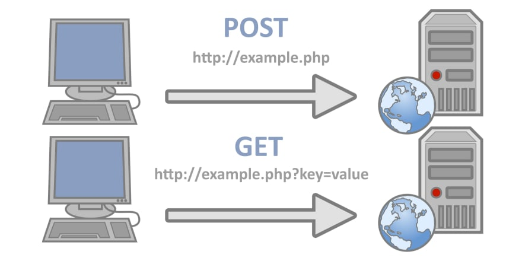

# Hands-on Flask-03 : Handling Forms and SQL with Flask Web Application

Purpose of the this hands-on training is to give the students introductory knowledge of how to handle forms, how to connect to database and how to use sql within Flask web application on Amazon Linux 2 EC2 instance. 

## Learning Outcomes

At the end of the this hands-on training, students will be able to;

- install Python and Flask framework on Amazon Linux 2 EC2 instance.

- build a web application with Python Flask framework.

- handle forms using the flask-wtf module.

- configure connection to the `sqlite` database.

- configure connection to the `MySQL` database.

- work with a database using the SQL within Flask application.

- use git repo to manage the application versioning.

- run the web application on AWS EC2 instance using the GitHub repo as codebase.

## Outline

- Part 1 - Getting to know HTTP methods (GET & POST).

- Part 2 - Install Python and Flask framework Amazon Linux 2 EC2 Instance 

- Part 3 - Write a Sample Web Application with forms and database implementation on GitHub Repo

- Part 4 - Run the Sample Web Application on EC2 Instance

## Part 1 - Getting to know HTTP methods (GET & POST)

HTTP (Hypertext Transfer Protocol) is a request-response protocol. A client on one side (web browser) asks or requests something from a server and the server on the other side sends a response to that client. 

When sending request, the client can send data with using different http methods like `GET, POST, PUT, HEAD, DELETE, PATCH, OPTIONS`, but the most common ones are `GET` and `POST`.

- HTTP `GET` method request;
    
    - used to request data from a specified resource.

    - can be cached.

    - remains in the browser history.

    - can be bookmarked

    - should never be used when dealing with sensitive data.

    - has length limitation.

    - only used to request data, not to modify it.  

- HTTP `POST` method request;
    
    - never cached.

    - does not remain in the browser history.

    - can not be bookmarked

    - can be used when dealing with sensitive data.

    - has no length limitation.

## Part 2 - Install Python and Flask framework on Amazon Linux 2 EC2 Instance 

- Launch an Amazon EC2 instance using the Amazon Linux 2 AMI with security group allowing SSH (Port 22) and HTTP (Port 80) connections.

- Connect to your instance with SSH.

- Update the installed packages and package cache on your instance.

- Install `Python 3` packages.

- Check the python3 version

- Install `Python 3 Flask` framework.

- Install `flask_sqlalchemy`.

- Install `flask_mysql`.

## Part 3 - Write a Sample Web Application with forms and database implementation on GitHub Repo

- Create folder named `flask-03-handling-forms-and-sql-on-ec2-linux2` within `clarusway-python-workshop` repo

- Write an application with form handling and save the complete code as `app-form-handling.py` under `hands-on/flask-03-handling-forms-and-sql-on-ec2-linux2` folder.

- Import Flask modules

- Create an object named app

- Create a function named `home` which uses template file named `index.html` given under `templates` folder,
- send your name as template variable, and assign route of no path ('/')

- Write a function named `greet` which uses template file named `greet.html` given under `templates` folder
- and assign to the static route of ('/greet')

- Write a function named `login` which uses `GET` and `POST` methods,
- and template files named `login.html` and `secure.html` given under `templates` folder
- and assign to the static route of ('login')

- Add a statement to run the Flask application which can be reached from any host on port 80.

- Write an application with database implementation using `MySQL` and save the complete code as `app-with-mysql.py` under `hands-on/flask-03-handling-forms-and-sql-on-ec2-linux2` folder.

- Write a function named `find_emails` which find emails using keyword from the user table in the db,
- and returns result as tuples `(name, email)`.

- Write a function named `insert_email` which adds new email to users table the db.

- Write a function named `emails` which finds email addresses by keyword using `GET` and `POST` methods,
- using template files named `emails.html` given under `templates` folder
- and assign to the static route of ('/')

- Write a function named `add_email` which inserts new email to the database using `GET` and `POST` methods,
- using template files named `add-email.html` given under `templates` folder
- and assign to the static route of ('add')

- Add a statement to run the Flask application which can be reached from any host on port 80.

## Part 4 - Run the Hello World App on EC2 Instance

- Download the web application file from GitHub repo.

- Run the form handling web application

- Connect the web application from the web browser and try every page configured

- Connect the web application default `/` page from the terminal with `curl` command.

- Connect the web application `/greet` page with no param from the terminal with `curl` command.

- Connect the web application `/greet` page with `user=Sergio%20Taco` param from the terminal with `curl` command.

- Connect the web application `/login` page with `GET` method from the terminal with `curl` command.

- Connect the web application `/login` page with `POST` method from the terminal with `curl` command.

- Run the `sqlite` web application and showcase from the web browser.

- Run the `MySQL` web application and showcase from the web browser.

